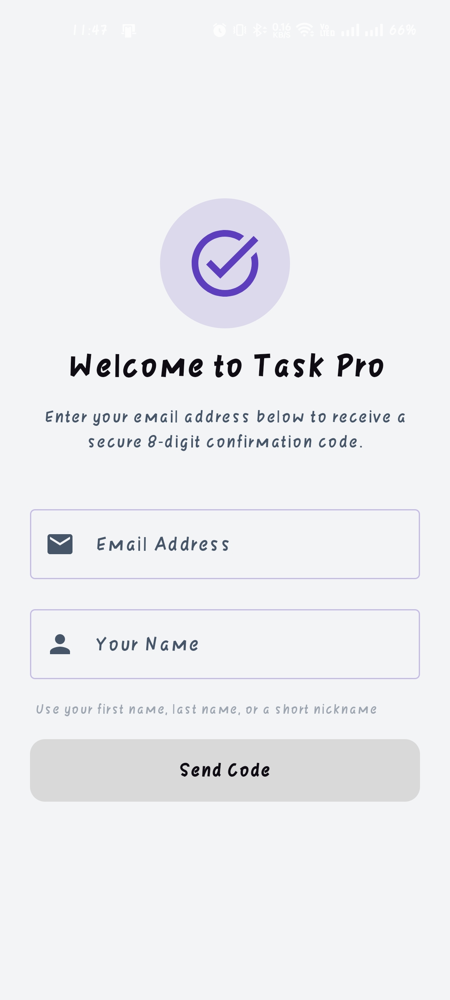
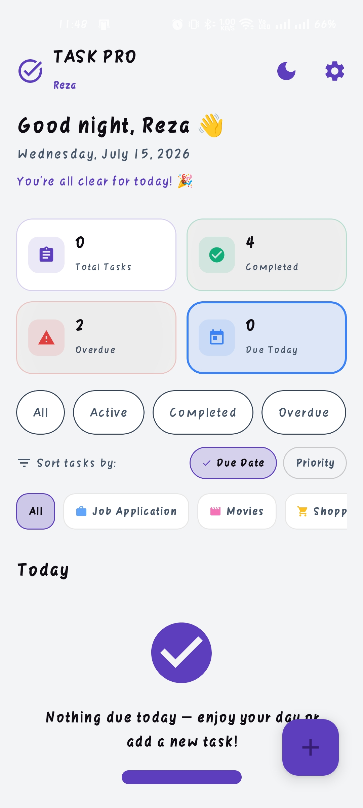
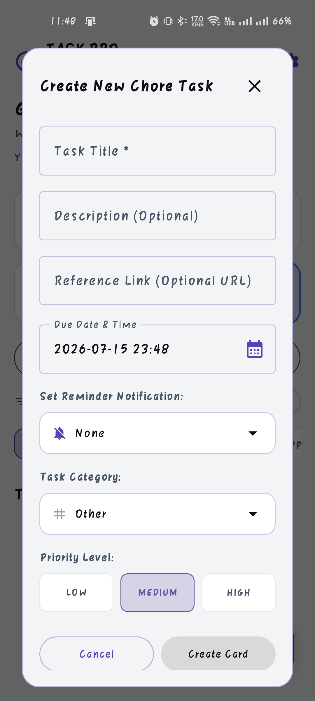
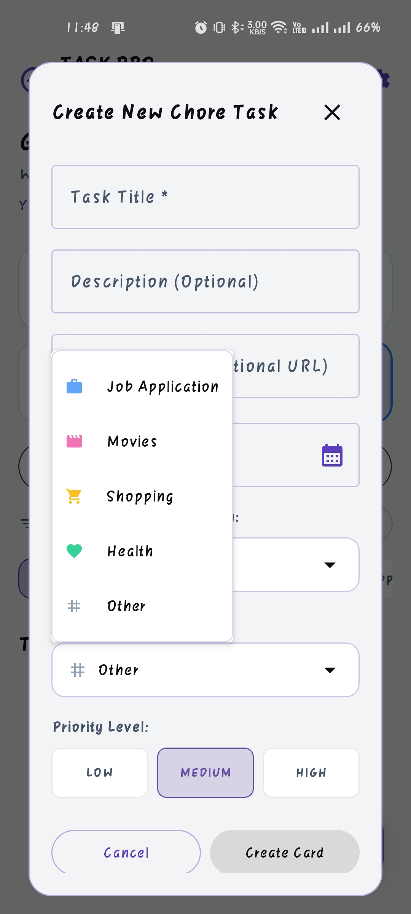

# 📋 Task Pro

A modern Android task management application built with **Kotlin** and **Jetpack Compose** that helps users organize, prioritize, and manage their daily tasks efficiently.

Task Pro provides secure authentication, cloud synchronization with offline support, task categorization, priority management, due dates, and reminder notifications, making it a practical productivity application.

---

## ✨ Features

### 🔐 User Authentication

* Secure user registration and login
* Individual user accounts
* Authenticated access to personal tasks

### ✅ Task Management

* Create, edit, and delete tasks
* Mark tasks as completed
* View active and completed tasks
* Organize tasks by category

### 📂 Categories

* Create custom task categories
* Filter tasks by category
* Better task organization

### 🚩 Priority Levels

* High Priority
* Medium Priority
* Low Priority

### 📅 Due Dates

* Assign due dates to tasks
* Easily identify upcoming deadlines

### ⏰ Reminder Notifications

* Schedule reminder alarms for tasks
* Receive local notifications before due dates

### Task Pro provides secure authentication, cloud synchronization with offline support, task categorization, priority management, due dates, and reminder notifications, making it a practical productivity application.

## 📸 Screenshots

| Login                      | Home                      |
|----------------------------|---------------------------|
|  |  |

| Add Task                      | Categories                      |
|-------------------------------|---------------------------------|
|  |  |

### ☁️ Cloud Synchronization

* Store tasks securely in Supabase
* Access tasks across devices using the same account

### 📱 Offline Support

* Continue managing tasks without an internet connection
* Synchronize changes when connectivity is restored

---

# 🛠 Tech Stack

| Category      | Technology                         |
| ------------- | ---------------------------------- |
| Language      | Kotlin                             |
| UI            | Jetpack Compose                    |
| IDE           | Android Studio                     |
| Backend       | Supabase                           |
| Networking    | Retrofit                           |
| HTTP Client   | OkHttp                             |
| JSON Parsing  | Moshi                              |
| Concurrency   | Kotlin Coroutines                  |
| Build System  | Gradle (Kotlin DSL)                |
| Local Storage | Android Local Storage              |
| Notifications | AlarmManager & NotificationManager |

---

# 🏗 Architecture

The application follows a modular architecture separating:

* UI
* Data
* Models
* Background receivers
* Network layer

This structure improves maintainability, scalability, and code organization.

---

# 🚀 Getting Started

## Prerequisites

* Android Studio
* Android SDK
* JDK 17+

---

# 🔮 Future Improvements

* Recurring tasks
* Widget support
* Shared task lists
* Team collaboration
* File attachments
* Statistics dashboard
* Wear OS support

---

# 👨‍💻 Author

**Mahmudul Hasan Reza**

Feel free to explore the project, provide feedback, or contribute through pull requests.

---
